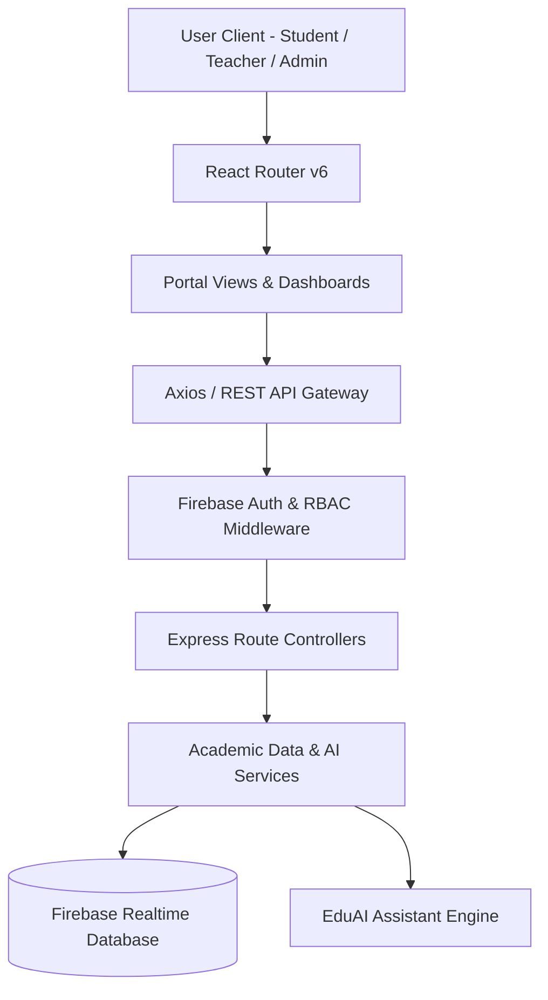

# Education Management Portal


**Education Management Portal (EduPortal)** is a full-stack, role-based academic administration platform. It unifies student progress tracking, faculty class management, institutional metrics, and intelligent academic assistance into a single, cohesive web application.

---

## The Problem
Modern educational institutions often rely on fragmented software tools for attendance, grading, assignment distribution, and student risk tracking. This fragmentation leads to:
- Disconnected student progress records and delayed academic interventions.
- High administrative overhead for teachers managing multiple spreadsheets.
- Lack of real-time institutional telemetry for university administrators.

## The Solution
EduPortal consolidates academic management into a unified system by:
1. **Role-Based Portals**: Providing tailored workflows for Students, Teachers, and Administrators.
2. **Automated Progress Tracking**: Real-time calculation of GPAs, course progress, and assessment ledgers.
3. **Attendance & Absence Logs**: Subject-wise attendance tracking and monthly calendar ledgers with automated excuse workflows.
4. **Early Academic Risk Alerts**: Intelligent student risk monitoring highlighting students needing academic support.
5. **EduAI Assistant**: An integrated academic assistant providing instant guidance, study planning, and navigation assistance.

---

## Core Feature Breakdown

### Student Portal Features
- **Interactive Dashboard**: Real-time StatCards displaying Cumulative GPA, Enrolled Courses, Overall Attendance Percentage, and Study Streak.
- **Active Course Directory**: Visual progress tracking for enrolled subjects (e.g., Data Structures, Calculus, Physics, DBMS) with grade chips and completion bars.
- **Grades & GPA Ledger**:
  - Interactive Course GPA Directory with instant course selection.
  - Assessment Ledger Breakdown detailing component weights (Quizzes 15%, Labs 35%, Midterms 25%, Finals 25%), numerical scores, and visual performance progress bars.
  - Provisional grade notice banner alerting students to board verification schedules.
- **Attendance & Log Directory**:
  - Subject-wise Attendance Logs formatted with percentage progress bars and status badges (Good Standing, Satisfactory, Needs Attention).
  - Monthly Calendar Grid featuring day-by-day attendance status records and a built-in Request Excuse workflow modal.
- **EduAI Study Recommendations**: Automated study task checklist prioritizing daily assignments and review topics with one-click completion.

### Teacher Dashboard Features
- **Faculty Command Center**: Real-time metrics tracking Total Enrolled Students, Active Classes Taught, Active Assignments, Average Class Attendance, and Pending Grading items.
- **Quick Action Bar**: One-click shortcuts for creating assignments, marking class attendance, entering marks, and opening AI analytics.
- **Assignment Submissions Ledger**:
  - Filterable assignment directory with category search and submission counts.
  - Detailed student submission ledger displaying file attachments, submission timestamps, status tags (Submitted, Late, Graded), and online score entry.
- **Class Rosters & Attendance**: Real-time daily attendance logger with present/absent toggles and instant history records.
- **Performance Risk Alerts**: Automated AI-driven risk indicators highlighting students who need additional academic assistance.

### Admin Portal Features
- **Institutional Telemetry**: Executive metrics covering Total Active Students, Faculty Members, Active Departments, System Uptime, and Monthly Operating Budgets.
- **Administrative Control Panel**: User management tools for adding new students and teachers, viewing system audit logs, and backing up system data.
- **Department Analytics**: Department enrollment distribution metrics and live system activity logs.

### EduAI Floating Assistant
- **Contextual AI Bot**: Integrated floating assistant available across all pages offering course advice, study schedule suggestions, GPA calculations, and portal navigation help.

---

## Architecture & Tech Stack

This project follows a client-server architecture with role-based access control and integrated AI service fallbacks:

- **Frontend:** React 18, Vite, React Router v6, Lucide Icons, Custom CSS with Paper Buddy Design Tokens.
- **Backend:** Node.js, Express.js, Firebase Admin SDK (Realtime Database & Authentication).
- **Security:** Role-Based Access Control (RBAC) middleware for Student, Teacher, and Admin routes.



---

## Repository Structure

```text
Education-Management-Portal/
├── client/                  # React SPA frontend application
│   ├── public/              # Static assets and vector icons
│   └── src/
│       ├── components/      # Reusable UI components and EduAI Bot
│       ├── pages/           # Admin, Student, and Teacher portal pages
│       ├── services/        # Client API services and mock handlers
│       └── index.css        # Paper Buddy design system tokens
└── server/                  # Node.js + Express backend service
    └── src/
        ├── config/          # Firebase Admin SDK initialization
        ├── controllers/     # Route handler logic
        ├── middleware/      # Authentication & RBAC protection
        └── services/        # Core business logic services
```

---

## Security & Data Safeguards

- **Role-Based Isolation**: Access control enforced at both route guard and Express middleware levels.
- **Secret Protection**: Firebase credentials and private environment keys are excluded via `.gitignore`.
- **Defensive Error Handling**: Optional chaining and fallback data initializations prevent unexpected rendering exceptions.

---

## Getting Started

### Prerequisites
- Node.js (v18+)
- npm (v9+)

### 1. Client Setup (Frontend)
```bash
cd client
npm install
npm run dev
```

### 2. Server Setup (Backend)
```bash
cd ../server
npm install
npm run dev
```

---

## Demo Account Access

You can test the application instantly using the 1-Click Demo Login on the sign-in page:
- **Student Demo**: Access full student dashboard, GPA transcript, attendance logs, and EduAI tasks.
- **Teacher Demo**: Access faculty command center, assignment grading ledger, and student risk insights.
- **Admin Demo**: Access institutional analytics, user management, and system activity logs.
